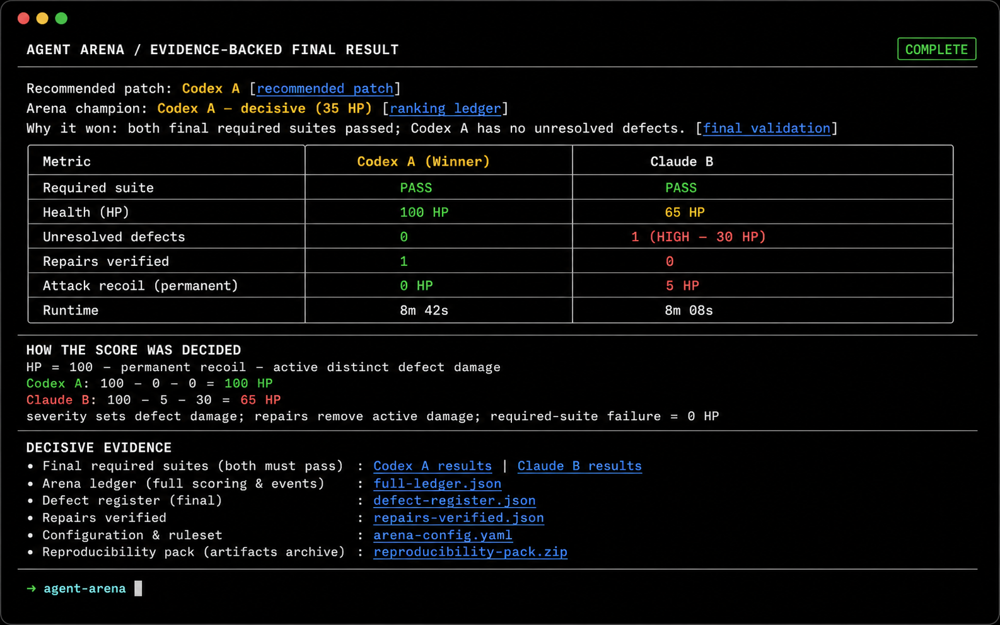
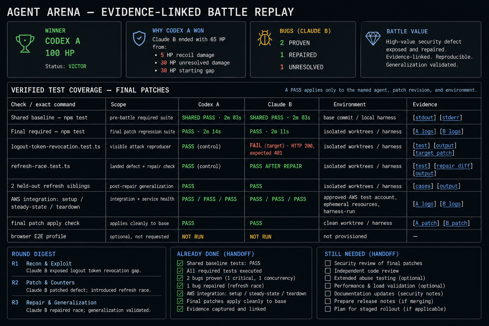

# Evidence-Linked Battle Results & Round Replay Design

> New runs render one failure-handling ledger with stage, up to two attempts,
> diagnostic links, retry outcome, judge basis, confidence effect, and score
> effect. Recovery credits, infrastructure debate, reconciliation, evidence
> revisions, and harness overlays are legacy-only report sections.

## Purpose

Make Agent Arena's result feel like an evidence-backed engineering win, not a
game score. A developer should be able to answer four questions immediately:

1. Which patch should I review or apply?
2. Did both implementations pass the required validation?
3. What real bugs did the battle expose, and were they actually repaired?
4. What evidence should I inspect next?

The opening summary must answer these four questions in order:

1. **Who won?** Arena champion and recommended patch, with final health and
   required-validation state.
2. **Why did they win?** The exact health-ledger difference and the decisive
   final validation/recommendation rationale.
3. **What bugs were found, and why are they real?** For every decisive defect:
   the broken invariant or requirement, observed failing behavior, target patch,
   executable reproducer, oracle/verifier rationale, severity, and repair state.
4. **What did the battle add?** A concise, evidence-bounded value statement:
   defects found after baseline validation, defects repaired before delivery,
   unresolved release risks, and the resulting review/apply decision. Each count
   links to the underlying tests and artifacts. Never claim that an issue was
   missed by the original suite unless the recorded baseline passed and the
   battle reproducer subsequently failed.
5. **What has already been verified, and what is left?** An explicit test
   coverage inventory names every harness-executed check, its environment, last
   result, execution time, and artifact link; a separate handoff checklist names
   only outstanding developer actions.

The visual language is balanced: restrained arena terminology and strong result
hierarchy make the battle memorable; commands, deterministic checks, and
reproducers establish trust.

## Visual direction

- Dark terminal/report backdrop with calm, high-contrast panels.
- Green denotes verified passing or repaired work; amber denotes review or a
  close decision; red denotes an unresolved defect or failure; slate denotes
  neutral/informational states.
- Every colored state also has text: `PASS`, `REPAIRED`, `UNRESOLVED`,
  `RECOIL`, or `INFRA`.
- Treat health as a traceable engineering ledger (`100 -> 70 HP`), never as an
  unexplained game score.
- Use human labels such as `Codex A` and `Claude B` in reader-facing content;
  preserve stable slot IDs in artifact references and JSON.
- Every high-level claim has an adjacent, clickable evidence link. A reader
  should never have to search the run directory to verify a verdict.

## Mockups

### Terminal finale — decision in one screen



The terminal is intentionally brief. It gives the verdict, validation status,
head-to-head comparison, decisive evidence, and the next safe commands. It
does not try to duplicate the full forensic report.

```text
AGENT ARENA  /  FINAL RESULT                                  COMPLETE

Recommended patch   Codex A        Arena champion   Codex A — decisive (30 HP)
Why it won           Both patches passed final validation; Codex A has no
                     unresolved defects after Claude B's logout regression held.

                         Codex A                  Claude B
Required suite          PASS                     PASS
Health                  100 HP                   65 HP
Unresolved defects      0                        1  (HIGH — 30 HP)
Repairs verified        1                        0
Attack recoil           0                        5 HP
Runtime                 8m 42s                   8m 08s

DECISIVE EVIDENCE
  R3  Codex A exposed: logout leaves a stale refresh token  HIGH  UNRESOLVED
      [reproducer] [verifier rationale] [target patch] [repair attempt]
  R2  Claude B exposed: concurrent refresh race             HIGH  REPAIRED
      [reproducer] [held-out cases] [repair validation]

Review: agent-arena review <run-id>   Apply: agent-arena apply <run-id> --agent a
Replay: .agent-arena/runs/<run-id>/report.md
```

### Markdown replay — evidence without raw-artifact hunting



The Markdown report opens with the recommendation and proof, then follows the
causal story of the battle. Deep operational details remain available later in
the same report rather than competing with the decision.

1. **Verdict and scorecard.** Champion, advisory recommendation, validation,
   margin, and a short explanation in plain engineering language. Every line
   includes a compact evidence link such as `[final required check]`,
   `[ranking ledger]`, or `[recommended patch]`.
2. **Decisive evidence.** A compact ledger of landed defects, their severity,
   current repair state, damage, severity rationale, reproducible evidence, and
   direct artifact links. Each row uses a fixed evidence sentence: “Expected
   **X**; observed **Y** on **target patch**; reproduced by **command/test**;
   authoritative because **oracle**.”
3. **Round replay.** Every round has a self-contained recap: its investigation
   goal; the attacks submitted by each contestant; adjudication status and
   target impact; repair action and outcome; checks rerun; and each contestant's
   health movement from round start through repair. This makes the causal chain
   readable without opening raw transcripts.
4. **Battle phases.** A clear phase rail distinguishes `IMPLEMENT`, `ATTACK`,
   `REPAIR`, `VALIDATE`, and `HUMAN REVIEW`. The round replay nests attacks and
   their target repairs beneath the same round rather than treating every
   invocation as equivalent.
5. **Validation matrix.** Required suite, focused reproducers, held-out sibling
   cases, and integration/service checks are clearly separated. The report shows
   the latest outcome first and retains every command/artifact for drill-down.
   The top-level **Verified test coverage** panel lists the actual command or
   test profile and environment—e.g. `npm test` (local worktree) or `AWS
integration profile` (approved ephemeral test account)—so a developer can
   rely on a successful harness run without rerunning it. It also lists `NOT
RUN`, `SKIPPED`, and `INFRA` explicitly; absence never implies verification.
   Results are always contestant-scoped: show adjacent `Codex A` and `Claude B`
   outcome cells for a candidate-specific check, and label a genuinely shared
   preflight result as `Shared baseline` rather than implying either patch passed.
6. **Rounds and handoff.** Replace the single expanded final-round card in the
   overview with a three-row round digest (focus, attacks proven, repairs
   verified, remaining defects, and links). Follow it with **Already done** and
   **Still needed** checklists that distinguish completed harness work from
   required human review or unresolved engineering risk.
7. **Patch review.** Existing quality facts become a small comparison table:
   production and test footprint, manifests, observability changes, and final
   patch locations.
8. **Operational appendix.** Invocation metadata, recovery credits, overlays,
   provenance, transcripts, and raw commands remain replayable but no longer
   interrupt the narrative.

## Content model and rules

| Surface                | Must answer                                                                     | Source data                                                           |
| ---------------------- | ------------------------------------------------------------------------------- | --------------------------------------------------------------------- |
| CLI finale             | What won, why, what next?                                                       | ranking, recommendation, final checks, outcome, decisive attacks      |
| Report verdict         | Is this safe to review/apply?                                                   | final validation, champion/recommendation, outcome margin             |
| Battle value           | What did adversarial testing add beyond the baseline?                           | baseline checks, landed defects, repairs, final checks                |
| Verified test coverage | Which exact checks passed for which final patch, where, and with what evidence? | contestant checks, commands, integration profile, command artifacts   |
| Handoff                | What is complete and what action remains?                                       | final checks, repair state, recommendation, review prompt             |
| Defect ledger          | What did the battle prove?                                                      | attacks, root defects, case bundles, repair health events             |
| Phase timeline         | Which implementation, attack, repair, and review action changed the result?     | contestant round results, attacks, invocations, checks, health events |
| Validation matrix      | Which evidence passed or failed?                                                | all check results and command artifacts                               |
| Patch review           | What changed and where?                                                         | patch-quality facts and final patch artifacts                         |

- A defect appears once in the ledger, keyed by `rootDefectId`; additional cases
  are evidence for that same defect rather than separate score events.
- Each defect ledger row must include **Expected / invariant**, **Observed
  failure**, **Why it matters**, **Affected patch**, **Reproducer**, **Oracle**,
  **Severity and damage**, and **Repair verification**. `LANDED` is the
  adjudication label, not the explanation; it cannot appear without those
  details.
- Add a four-item **Developer takeaway** card directly after the verdict:
  winner, decisive reason, bugs found (repaired versus unresolved), and battle
  value. When no qualifying baseline-to-attack gap exists, say “No additional
  defect beyond declared validation was proven,” rather than implying value.
- Add a **Verified test coverage** panel before the defect ledger. Each entry
  has `PASS` / `FAIL` / `INFRA` / `SKIPPED` / `NOT RUN`, exact command or profile
  name, execution environment, executed-at time, duration, scope, and direct
  stdout/stderr link. Group results as original required suite, focused visible
  reproducers, held-out siblings, integration/service checks, and final
  validation. A green `PASS` explicitly means the harness ran that named check
  in the named environment; it never means all possible checks passed.
- Use a compact **check × contestant** matrix: `Check / command`, `Scope`,
  `Codex A`, `Claude B`, `Environment`, and `Evidence`. Each contestant cell
  includes the latest status, duration, and direct logs; a failure also links to
  the reproducer and target patch. Collapse repeated command text, not distinct
  checks. At minimum, retain separate rows for: baseline required suite;
  initial and final required suite per patch; final-patch apply check; every
  visible landed-defect reproducer; held-out sibling cases; integration profile
  setup, steady-state, and teardown/service health; and any declared lint,
  typecheck, build, security, or performance check actually run.
- Show the check's **applicability** precisely. A differential reproducer might
  read `Codex A: PASS (control)` and `Claude B: FAIL (target)`; a repaired defect
  reads `PASS after repair` for the repaired patch; an unrun optional profile
  reads `NOT RUN` for both. Do not collapse a check into “passed” if it was run
  for only one contestant, one patch revision, or one environment.
- Render the integration environment in plain language from the approved
  integration profile and capability manifest (for example, “AWS test account,
  ephemeral resources, harness-run”). Never display credentials, account IDs,
  endpoints, or secrets. If an AWS/integration profile was not run, say so
  directly and place it in **Still needed** only when it is a declared required
  check.
- A repair is displayed as `REPAIRED` only after the relevant accepted cases and
  final required validation pass. Otherwise it remains `UNRESOLVED`.
- Severity is shown as a badge and a consequence: `CRITICAL — 50 HP`,
  `HIGH — 30 HP`, `MEDIUM — 15 HP`, or `LOW — 5 HP`. The ledger also shows the
  verifier's severity rationale and whether the damage is active, healed, or
  neutralized by elimination.
- The UI must distinguish **attack severity** (impact of a proven target defect)
  from **attack rank** (the attacker's 1–3 submission order) and **recoil**
  (the attacker's penalty for an invalid, duplicate, self-defeating, unproven,
  blocked, or otherwise unsuccessful ranked attack).
- Add a score explainer beside the scorecard: `final health = 100 − permanent
recoil − active distinct defect damage`, clamped to `0–100`. Show the actual
  ledger for each contestant—for example, `100 − 0 recoil − 0 active damage =
100 HP` versus `100 − 5 recoil − 30 active damage = 65 HP`. A landed defect's
  severity determines its potential damage (50/30/15/5), but a successful
  repair removes that active damage; repeated evidence for the same root defect
  never stacks. Failed required validation eliminates a patch to 0 HP regardless
  of its ledger total.
- Explain the decision hierarchy directly under that formula: surviving patch
  with the highest final HP wins; a configured patch-size comparison may break
  an HP tie; otherwise the result is a draw. Cost and duration remain visible
  context, not score inputs.
- Infrastructure errors are visibly distinct from a patch failure and do not
  imply a winner by themselves.
- In siege mode, present only the defender's production patch and state that
  patch comparison is intentionally unavailable.
- If arena champion and correctness-first recommendation differ, show both at
  equal prominence and explain that health scoring did not change.

## Implementation guidance

- Keep `result.json` and raw run artifacts unchanged as the source of truth.
- Add report-only aggregation helpers for latest checks, per-round summaries,
  deduplicated root defects, repair state, decisive events, and duration totals.
- Render every artifact reference as a relative Markdown link from `report.md`:
  final patch, original and final required check stdout/stderr, attack patch,
  focused command output, visible and held-out case files, verifier rationale,
  repair transcript, task contract, ranking ledger, and review prompt. Use the
  recorded paths; never invent a path or make a claim without a persisted
  source. In the terminal, emit OSC 8 file hyperlinks when supported and show a
  readable relative path when hyperlinks or color are disabled.
- Provide a small evidence-link resolver that rejects missing/outside-run paths,
  converts stored absolute artifact paths into report-relative URLs, and uses a
  stable human label rather than exposing hashes as the primary link text.
- Render phase headers as explicit stage groups: `IMPLEMENTATION` (initial
  patch and baseline), each round's `ATTACK` submissions and adjudication,
  `REPAIR` actions, `VALIDATION` checks, then final `HUMAN REVIEW`. Preserve
  special `INFRASTRUCTURE REVIEW` and `RECOVERY` phases rather than labelling
  them as attacks or fixes.
- Render each normal round as an expanded, paired recap with this fixed order:
  **Goal**, **Attack submissions**, **Adjudication**, **Repair**, **Validation**,
  and **Health ledger**. For every submitted attack, show author, rank, claim,
  target, proposed versus verifier-assigned severity where applicable, outcome,
  and evidence links. For repairs, show whether an agent attempted a change,
  which defects it addressed, the repair transcript/diff, and the exact checks
  that confirmed or rejected it. Collapse only lower-priority rejected attacks;
  never collapse a landed, recoiled, infrastructure-reviewed, or repair-related
  event.
- The overview uses a compact **Round digest**, not an expanded final-round
  detail card: one row each for Rounds 1–3 with focus, meaningful outcomes,
  health change, repaired/unresolved status, and a `[open round evidence]`
  link. Detailed per-round records remain below the handoff or behind links.
- Add two explicit handoff groups below the round digest. **Already done** lists
  immutable task capture, implementation/attack/repair work, and every verified
  check. **Still needed** includes only unresolved defects, an unexecuted
  required profile, or a human review/apply decision; show `Nothing required
before review` when that list is empty. Do not list an optional, unrequested
  environment (such as AWS integration) as remaining work merely because it
  exists.
- In each round recap, replace bare outcome labels with an **Observed result**
  line: the failing assertion/output/exit condition and the matching expected
  behavior. Pair it with **Why it matters** (user impact, security boundary,
  data integrity, or contract breach) and links to the test, command output,
  oracle, and target patch. Rejected attacks state why the evidence did not
  prove the claim; repairs state exactly which test results turned the defect
  from active to healed.
- Render ANSI styles only for interactive color-capable terminals; retain exact
  labels and alignment in no-color/redirected output.
- Escape report-table content and write focused fixture/snapshot tests for
  decisive wins, draws, elimination, no attacks, repaired defects,
  infrastructure errors, recommendation/champion disagreement, and siege mode.
- Add link-integrity coverage: every displayed final-result claim links to an
  existing run artifact; links are report-relative, escape correctly, and no
  resolved path can leave the run directory. Snapshot mixed implementation,
  attack, repair, validation, recovery, and human-review phase timelines.
